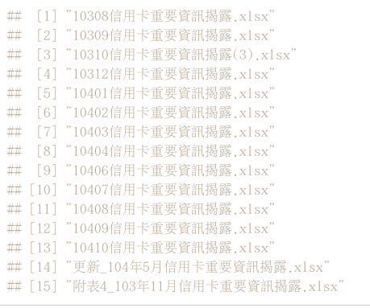
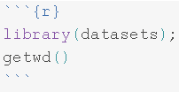
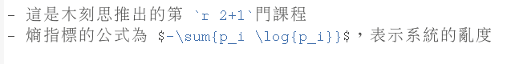
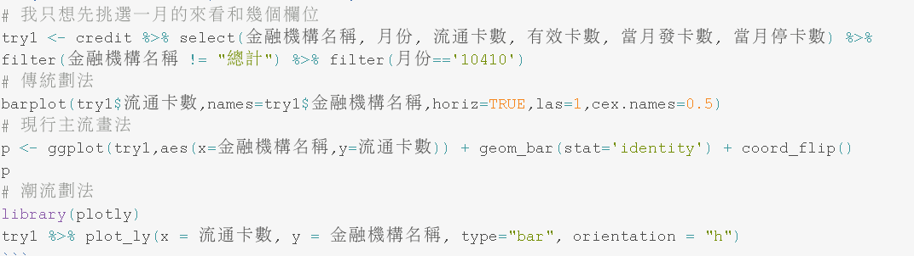
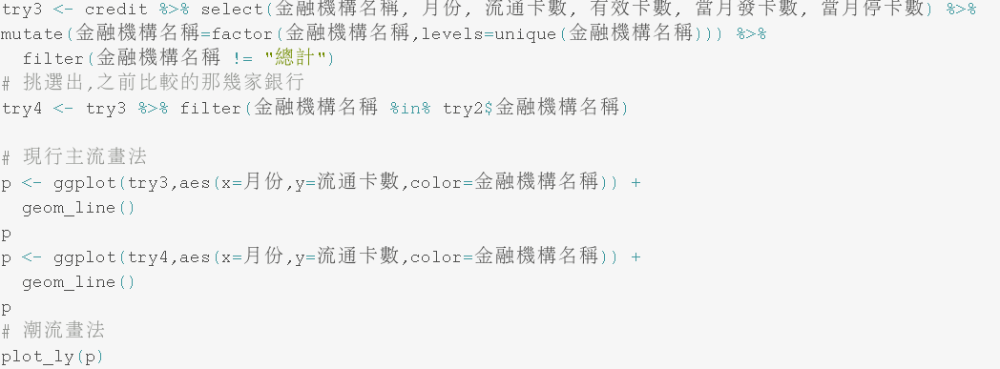

```{r include=FALSE,cache=TRUE}
knitr::opts_chunk$set(comment="", message=FALSE, warning=FALSE, fig.width=12, fig.height=8.5)
library(datasets)
library(dplyr)
library(ggplot2)
library(devtools)
library(reshape2)
library(rmarkdown)
library(knitr)
library(plotly)
```

# 0 關於教材授權

本教材之智慧財產權，
屬木刻思股份有限公司所有。

如果有朋友，覺得此教材很棒，希望能分享給朋友，或是拿此教材開課。非常歡迎大家來信至 course@agilearning.io 請求教材的使用授權唷！

---

# 1 Mini example to overview ETL + Viz

- ### Fist Thing check your environment

```{r}
library(datasets);library(dplyr);library(ggplot2);library(devtools);library(reshape2)
getwd()
```

- ### Load Data & Setting Env

- ### 1. 打開 `shell` 輸入指令下載資料集

  + `git clone https://github.com/whizzalan/RReportCrashCourse.git`

- ### 2. 在 RStudio console 輸入指令，切換工作目錄並確認下載內容。

```{r, eval=FALSE}
setwd("RReportCrashCourse")
```
```{r}
dir()
```
```{r eval=FALSE}
### 如果沒辦法讀到資料的直接執行看看下面程式馬
url <- "https://github.com/whizzalan/RReportCrashCourse/raw/gh-pages/data/datasets.rda"
download.file(url,paste0(getwd(),"/data/datasets.rda"))
load("data/datasets.rda")
# 列出R環境中有的物件
# datasets::anscombe, Cl_info, creditData
ls()
```
```{r,echo=FALSE}
#講師自己背後讀
# save(Cl_info,quartet,creditData,file = "data/datasets.rda")
load("data/datasets.rda")
ls()
```

- ### 先前的數據觀察，小挑戰（Data Aggregation）

## 1.1 Anscombe's quartet dataset

```{r}
quartet
```

- ### 試做出下列表單
```{r,echo=FALSE}
# http://www.r-bloggers.com/using-and-abusing-data-visualization-anscombes-quartet-and-cheating-bonferroni/
# data(anscombe) 
# dat <- melt(anscombe)
# dat$variable <- as.character(dat$variable)
# coordinate <- t(as.data.frame(strsplit(as.character(dat$variable),"")))
# rownames(coordinate) <- 1:dim(coordinate)[1]
# df <- bind_cols(as.data.frame(coordinate),data.frame(value = dat$value))
# DF <- cbind(df[df$V1=="x",c("V2","value")],df[df$V1=="y","value"])
# colnames(DF)<- c("set","x","y")

# 不用 datasets::anscombe，用整理好的quartet
quartet %>%
  group_by(set) %>%
  summarize(mean(x),sd(x),mean(y),sd(y),cor(x,y))
```

### [HINT](https://suensummit.github.io/RCourseBankSinoPac/week2handouts.html)
- 回顧第二週ETL所學的 Example 5: group_by + summarise

```{r}
Cl_info %>% 
  group_by(bank_nm) %>% 
  summarise(mean(mortgage_cnt))
```


<!-- end of list -->

---

# 1.2 Charts with ggplot2

- ### The importance of graphing data before analyzing

```{r}
library(ggplot2)
p = ggplot(quartet, aes(x, y)) + geom_point()
p = p + geom_smooth(method = lm, se = FALSE)
p = p + facet_wrap(~set)
p
```

## 1.3 ggplot Usage 

- qplot() - for quick plots

> qplot(x, y, data=, color=, shape=, size=, alpha=, <br>
  　　　geom=, method=, formula=, facets=, <br>
  　　　xlim=, ylim= xlab=, ylab=, main=, sub=)

- ggplot() - for fine, granular control of everything
    - dataframe, aes()
    - multi-layers
    - geom_`xxx`(): Geometric objects that define the basic "shape" of the elements on the plot
        - [ggplot online help topics](http://docs.ggplot2.org/current/)

> ggplot(data = , aes( x = , y = ), fill = , colour = ) + <br>
  　　　　geom_() + <br>
  　　　　theme_() + <br> 
  　　　　coord_() + facet_() + stat_ () + ... <br>


```{r}
# list all geom
ls(pattern = '^geom_', env = as.environment('package:ggplot2'))
ls(pattern = '^stat_', env = as.environment('package:ggplot2'))
```


<!-- end of list -->

---

# 2 EDA from Data Visualization

## 2.1 ETL Recap & barchart

- ### 再次複習第二週所用資料，資料來源：10308-10410信用卡重要資訊揭露

```{r}
# 觀看資料外觀
dim(creditData)
# show 資料欄位
names(creditData)

# Glance：窺一窺
head(creditData,5)
tail(creditData,5)
str(creditData)
```

### 2.1.1 Data Wrangling First Step: data cleaning

- 資料中月份欄位髒髒的



```{r}
# 確認問題欄位
unique(creditData$月份)
credit <- creditData
# 更改資料格式
credit$月份 <- as.character(credit$月份)
credit$月份 <- ifelse(test = credit$月份 == "更新_10", yes = "10405", no = credit$月份)
credit$月份 <- ifelse(test = credit$月份 == "附表4_1", yes = "10311", no = credit$月份)
unique(credit$月份)
```

```{r, echo=FALSE, eval=FALSE}
# another way view data
page(credit)
```


### 2.1.2 Data Wrangling Second Step: data type conversion

```{r data, cache = TRUE}
# dplyr::mutate is fast !!!
credit <- credit %>% mutate(
  月份 = as.numeric(月份)
)
# 試畫看看，我發現惹什麼問題？
credit %>% ggplot(aes(x=月份,y=流通卡數)) + geom_line(aes(group=金融機構名稱))
```

### 2.1.3 Data Wrangling: filter your data

```{r filterToBarChart, cache = FALSE}
# 我只想先挑選10月的來看和幾個欄位
try1 <- credit %>% select(金融機構名稱, 月份, 流通卡數, 有效卡數, 當月發卡數, 當月停卡數) %>% filter(金融機構名稱 != "總計") %>% filter(月份=='10410')
# 傳統劃法
barplot(try1$流通卡數,names=try1$金融機構名稱,horiz=TRUE,las=1,cex.names=0.5)
# 現行主流畫法
p <- ggplot(try1,aes(x=金融機構名稱,y=流通卡數)) + geom_bar(stat='identity') + coord_flip()
p
# 潮流劃法
library(plotly)
try1 %>% plot_ly(x = 流通卡數, y = 金融機構名稱, type="bar", orientation = "h")
```

### 2.1.4 Data Wrangling: arrange your data

```{r arrangeToBarChart, cache = FALSE}
# 將資料排序畫圖
try1 <- try1 %>%  arrange(desc(流通卡數))
head(try1)
# 找出永豐銀行的位置, #7
index=which(try1$金融機構名稱=="永豐商業銀行")

## 由於金融機構名稱並非factor,ggplot2 group顏色吃factor
# transformation
try1 <- try1 %>% mutate(金融機構名稱=factor(try1$金融機構名稱,levels=try1$金融機構名稱))

# 挑選出永豐銀行前後兩的來比較
try2 <- try1 %>% filter(between(row_number(),index-3,index+3))

# 傳統畫法
barplot(try2$流通卡數,names=try2$金融機構名稱,horiz=TRUE,las=1,cex.names=0.4)
# 現行主流畫法
p <- ggplot(try2,aes(x=金融機構名稱,y=流通卡數)) + geom_bar(stat='identity') + coord_flip()
p
# 潮流畫法
library(plotly)
# 小技巧，要調整自型
a <- list(tickfont = list(color="blue", size = 7))
try2 %>% plot_ly(x = 流通卡數, y = 金融機構名稱, type="bar", orientation = "h") %>% 
  layout(xaxis = a, yaxis = a)
```

<!-- end of list -->

---

## 2.2 Line Plot

```{r Line, cache = FALSE}
try3 <- credit %>% select(金融機構名稱, 月份, 流通卡數, 有效卡數, 當月發卡數, 當月停卡數) %>% mutate(金融機構名稱=factor(金融機構名稱,levels=unique(金融機構名稱))) %>% 
  filter(金融機構名稱 != "總計")
# 挑選出,之前比較的那幾家銀行
try4 <- try3 %>% filter(金融機構名稱 %in% try2$金融機構名稱)

# 現行主流畫法
p <- ggplot(try3,aes(x=月份,y=流通卡數,color=金融機構名稱)) +
  geom_line()
p
p <- ggplot(try4,aes(x=月份,y=流通卡數,color=金融機構名稱)) +
  geom_line()
p
# 潮流畫法（簡單板，某些可以！）
plot_ly(p)
```

#### [練習&HW] 畫畫看 `有效卡數` 與 `當月發卡數` 

<!-- end of list -->

---

# 3 R Markdown Features

### 再次題列幾項好處

- 製作reproducible的報告、投影片: `document` 、 `slides`
- 想寫數學式子好展現自己的專業 $e=mc^2$:  `mathjax`
- 只有一份source code，不需要額外複製圖片到報告中: `.rmd`
- 增加資料分析演算法的可讀性: `code and text`
- HTML的報告和投影片的格式方便瀏覽: `html`
- IDE? RStudio提供支援: `Knit Button`

## 3.1 basic syntax (format)

- # #最大標題
- ## ##大標題
- ### ###標題
- ##### ####小標題
- 分段落：兩個斷行


- *斜體*： `*斜體字*`, **粗體**: `**粗體字**`
- `程式碼` 寫在行內：  ` `
-  區段程式碼(chunk code)： 


## 3.2 Overview with RSudio

- YAML Metadata （RStudio範例）
- Markdown （RStudio範例）
  + Makrdown Quick Reference  
  + [Markdown Cheatsheet](https://www.rstudio.com/wp-content/uploads/2015/02/rmarkdown-cheatsheet.pdf?version=0.99.764&mode=desktop)  
  + [Markdown Reference](https://www.rstudio.com/wp-content/uploads/2015/03/rmarkdown-reference.pdf?version=0.99.764&mode=desktop)  
- R Code Chunk  

## 3.3 Inline R Code chunk and Equations

- 利用 \`r\` 在markdown中插入R程式
- 插入 LaTeX 公式的方法：   
    * 行內`$ equation $`   
    * 段落 `$$ equation $$`  

- 
- 這是木刻思推出的第 `r 2+1`門課程
- 熵指標的公式為 $-\sum{p_i \log{p_i}}$，表示系統的亂度

#### [練習] chunk & chunk option 
  + 觀察將第一個 R Chunk中的 summary(cars) 改成 head(cars)
  + 觀察 echo = TRUE -> echo = FALSE 結果差異？
  + 觀察 eval = TRUE -> eval = FALSE 結果差異？
  + 觀察在 chunk option 多加入 results = 'asis' 結果差異？
  + 觀察 head(cars) 改成 knitr::kable(head(cars))

```{r codeChunkEx1, echo = TRUE , eval=TRUE}
summary(cars)
plot(cars)
```

```{r codeChunkEx2, echo = TRUE, eval=FALSE}
head(cars)
```

```{r codeChunkEx3, echo = TRUE, eval=TRUE, results="asis"}
knitr::kable(head(cars))
```

#### Basic Chunk Options

- `echo`(TRUE): whether to include R source code in the output file  
- `eval`(TRUE): whether to evaluate the code chunk  
- `message`(TRUE): whether to preserve messages emitted by message()  
- `include`(TRUE): whether to be written into the output document, but the code is still evaluated and plot files are generated  
- `warning`(TRUE): whether to preserve warnings in the output 
- `comment`("##"): set to comment notation 
- `results`('hide','asis'): hide output ; asis treats the output of your R code as literal Markdown (when using like kable function)

Set global chunk options at code chunks header:

```{r opt_chunk, eval=FALSE}
knitr::opts_chunk$set(comment="", message=FALSE, warning=FALSE, fig.width=12, fig.height=8.5)
library(datasets)
library(dplyr)
library(ggplot2)
library(devtools)
library(reshape2)
library(rmarkdown)
library(knitr)
library(plotly)
```

## 3.4 Rendering 

- RStudio: "Knit" command (Ctrl+Shift+K)
- Command line: rmarkdown::render function
```{r eval=FALSE, echo=TRUE}
rmarkdown::render("input.Rmd")
```

#### [練習&HW] 各種輸出
  + 輸出圖片 
  + 試著畫出之前的長條圖與線圖
  + HINT: 
  + HINT: 
  
### 3.5 Reference

- [Reproducible Research](https://www.coursera.org/course/repdata)
- [Shiny Gallery](http://shiny.rstudio.com/gallery/)
- [Shiny Atricles](http://shiny.rstudio.com/articles/)

<!-- end of list -->

#### 3.6 Q&A

---

